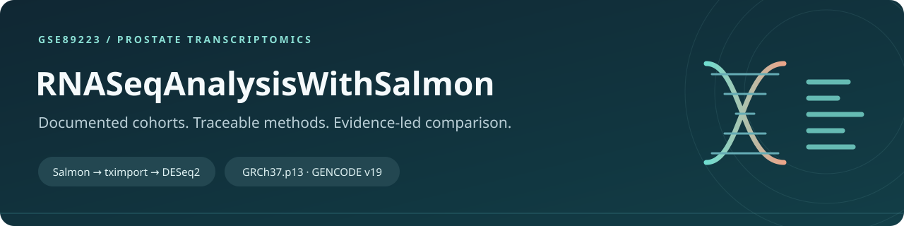
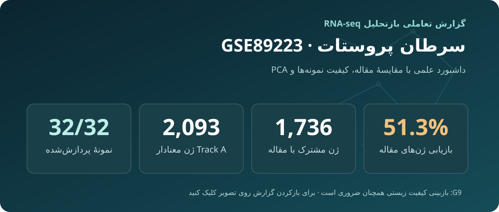
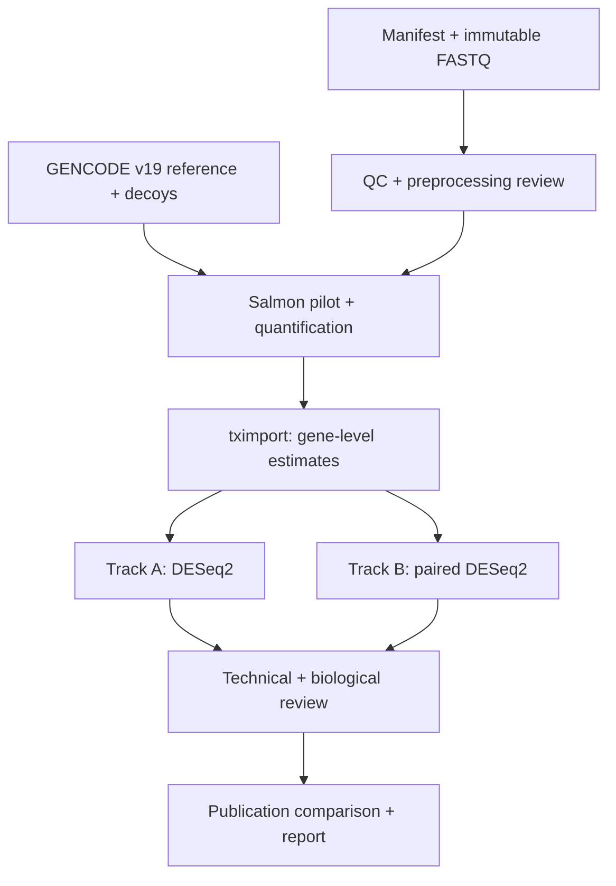

<!-- Repository presentation v1.0.0; scientific analysis versions are unchanged. -->


# RNASeqAnalysisWithSalmon

**A Salmon-first reanalysis of prostate cancer RNA-seq, with documented cohorts, validation gates and publication comparisons.**

[](https://github.com/KingriderHossein/RNASeqAnalysisWithSalmon/actions/workflows/repository-checks.yml)
[](https://www.ncbi.nlm.nih.gov/geo/query/acc.cgi?acc=GSE89223)
[](docs/ARCHITECTURE.md)
[](https://github.com/KingriderHossein/RNASeqAnalysisWithSalmon/issues/10)

[English](README.md) · [فارسی](README.fa.md) · [Get started](docs/GETTING-STARTED.md) · [Documentation](docs/README.md) · [Reports](docs/reports/README.md) · [Contribute](CONTRIBUTING.md)

This project compares **Salmon → tximport → DESeq2** results with the published **STAR → HTSeq → edgeR** analysis of [GSE89223](https://www.ncbi.nlm.nih.gov/geo/query/acc.cgi?acc=GSE89223). It preserves sample identity, reference provenance and two distinct statistical designs.

> [!IMPORTANT]
> Computational results through publication comparison are available. **G9 biological/scientific acceptance remains under review.** A passing repository check does not validate the biological findings. See the [scientific summary](docs/reports/GSE89223-final-advisor-scientific-summary-2026-10-09.md) and [reproducibility limits](docs/REPRODUCIBILITY.md).

## Explore the interactive report

[](docs/dashboard/index.html)

**[Report HTML](docs/dashboard/index.html)** · **[Raw HTML to save locally](https://raw.githubusercontent.com/KingriderHossein/RNASeqAnalysisWithSalmon/main/docs/dashboard/index.html)** · **[Scientific summary](docs/reports/GSE89223-final-advisor-scientific-summary-2026-10-09.md)**

The report has Persian RTL text, sample filters and interactive figures. GitHub displays HTML source. To use the report, download `docs/dashboard/index.html` and open the saved file in a browser. The report is a **dated results snapshot**; it is separate from the [workstation monitor](web/monitor/index.html).

## Study at a glance

| Item | Scope |
| :--- | :--- |
| Accessions | GSE89223 · SRP092131 · PRJNA350714 |
| Material | Human prostate tissue; FFPE |
| Sequencing | 32 single-end Ion Torrent Proton runs |
| Library | Total RNA / rRNA-depleted; **not strict Poly(A)+ mRNA-seq** |
| Reference | GRCh37.p13 + comprehensive GENCODE v19; matching genome decoys |
| Primary analysis | Salmon selective alignment → tximport → DESeq2 |
| Significance | BH-adjusted *p* < 0.05; no required absolute log2 fold-change cutoff |

The comprehensive reference retains coding and non-coding transcripts. Sample membership is defined in the [committed manifest](metadata/derived/GSE89223_sample_manifest.tsv), with [metadata provenance](metadata/README.md).

## Two questions, two analysis tracks

| | Track A · publication comparison | Track B · paired sensitivity |
| :--- | :--- | :--- |
| Samples | 10 tumor + 12 control | 9 matched tumor/adjacent-normal pairs |
| Design | `~ group` | `~ patient + condition` |
| Contrast | Tumor vs control | Tumor vs adjacent-normal |
| Purpose | Compare with the paper's final cohort | Assess sensitivity to the paired PCa design |

Track A controls include nine adjacent-normal PCa samples and three BPH samples. Track B excludes BPH samples and the unpaired CP2 sample. **The tracks share samples and are not independent validation cohorts.**

## Workflow



This is the intended gated workflow. Execution does not by itself close a gate. The original publication is the comparator; its pipeline is not rerun here. See the [full architecture](docs/ARCHITECTURE.md) and [validation requirements](docs/VALIDATION.md).

## Reported results

Snapshot from the [9 October 2026 scientific summary](docs/reports/GSE89223-final-advisor-scientific-summary-2026-10-09.md):

| Metric | Reported value |
| :--- | ---: |
| Valid Salmon outputs | 32 / 32 samples |
| Track A significant genes | 2,093 |
| Track B significant genes | 1,850 |
| Track A / published significant-gene intersection | 1,736 |
| Recovery of the publication's 3,384 significant genes | 51.30% |

Low transcriptome mapping and quality warnings remain important limits. Differences involve preprocessing, quantification and statistical methods; they cannot be assigned to Salmon alone. The published findings are comparison evidence, not ground truth.

## Get started

To inspect the project and run lightweight repository checks:

```bash
git clone https://github.com/KingriderHossein/RNASeqAnalysisWithSalmon.git
cd RNASeqAnalysisWithSalmon
python3 scripts/check_repository_v1.py
```

The check uses Python's standard library. It does not download sequencing data or execute the scientific scripts. Open `docs/dashboard/index.html` in a browser to explore the report.

**To reproduce the analysis**, first read [Getting started](docs/GETTING-STARTED.md) and [Reproducibility](docs/REPRODUCIBILITY.md). Several stage scripts retain workstation paths; a portable, fully locked environment is still pending. This repository is not yet a one-command analysis package.

## Repository map

| Location | What you will find |
| :--- | :--- |
| [docs/](docs/README.md) | Scientific specification, architecture, decisions and validation |
| [docs/reports/](docs/reports/README.md) | Dated stage evidence and the advisor summary |
| [docs/dashboard/](docs/dashboard/index.html) | Interactive Persian scientific report |
| [metadata/](metadata/README.md) | Sample provenance and the 32-run manifest |
| [config/](config/) | Versioned Salmon configuration record |
| [scripts/](scripts/) | Scientific stage scripts and repository checks |
| [web/monitor/](web/monitor/) | Workstation monitor frontend |
| [.github/](.github/) | Issue forms, PR template and repository CI |

Raw reads, reference sequences, Salmon indexes and large intermediate outputs stay outside Git. See the [data contracts](docs/DATA-CONTRACTS.md).

## Contribute and follow progress

Start with [CONTRIBUTING.md](CONTRIBUTING.md). Use [Issues](https://github.com/KingriderHossein/RNASeqAnalysisWithSalmon/issues) for reproducible problems and proposed improvements, and [pull requests](https://github.com/KingriderHossein/RNASeqAnalysisWithSalmon/pulls) for reviewed changes.

Current follow-up areas are [environment reproducibility](https://github.com/KingriderHossein/RNASeqAnalysisWithSalmon/issues/2), [G9 review](https://github.com/KingriderHossein/RNASeqAnalysisWithSalmon/issues/10) and [final reproducibility closure](https://github.com/KingriderHossein/RNASeqAnalysisWithSalmon/issues/12). Issue state is authoritative for ongoing work.

The former Rust/Tauri Download Manager is outside this scientific repository's scope. Its source remains in [Git history](https://github.com/KingriderHossein/RNASeqAnalysisWithSalmon/tree/6ee4dfa99d20c9b593f92525a191cef641eb3f75).

## Cite and reuse

For repository citation metadata, see [CITATION.cff](CITATION.cff). Include the exact commit and analysis ID when you use project results. Also cite the source study:

Nikitina AS et al. *Novel RNA biomarkers of prostate cancer revealed by RNA-seq analysis of formalin-fixed samples obtained from Russian patients.* Oncotarget (2017). [doi:10.18632/oncotarget.16518](https://doi.org/10.18632/oncotarget.16518).

**License:** No project license has been selected. Citation metadata does not grant reuse rights. See [contribution guidance](CONTRIBUTING.md#license-status).
